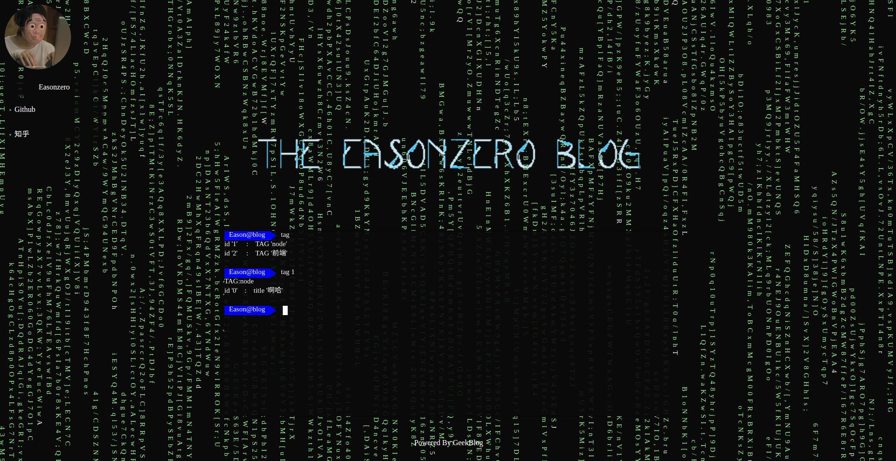

# GeekBlog

[](https://github.com/996icu/996.ICU/blob/master/LICENSE)
[](https://996.icu/#/zh_CN)

A Lite and Geek-Style Blog Generator  
一个`轻量的`、`极客风格`的博客生成器  

[geekblog展示博客](http://easonzero.github.io)

为什么说是极客风格呢？该博客生成器的默认主题采用终端风格，打造酷炫的geek风页面  
而且不单单只是风格，默认主题上的终端是完全可以使用的...  


### Installation
说实话写的好累啊- -  
这个东西就不挂在npm上了  
想用的人请自行clone，使用方法往下读

### Run

clone之后首先要在根目录下初始化全局命令:

```shell
sudo npm install -g
```

初始化:  

```shell
geekcli init    #初始化博客生成器
geekcli build   #构建、生成博客
geekcli server  #运行调试服务器，通过127.0.0.1:4000可以本地访问生成的博客
```

发布文章:  

```shell
geekcli post create ${文章路径} #创建文章
geekcli post update ${文章路径} #更新文章
geekcli post delete ${文章路径} #删除文章
```

ps.`data.json`文件中管理数据，目前可以在里面设置博客名、知乎链接、github链接、友链
### Themes DIY

首先，最后生成的页面是由完全静态的html、js、css文件组成，这意味着只要你会前端，就可以随意制作自己的主题。  

在这个前提下，GeekBlog提供了简单的模板功能，目前可以定制统一的文章`post`界面风格和主页`index`界面风格，之后会开放更多的模板，所有模板在layout文件夹下。  

在使用模板时需要注意的是，GeekBlog为模板提供了数据支持：  

* 模板中可以使用`{{}}`语法，在html中插入相应的数据，也可以通过在js中直接调用data获得所有数据。
* 在post模板中，可以调用所有与本文章相关的数据
* 在post之外的模板中，可以调用所有数据
* 可调用的数据键名和数据格式请参考`./data.json`中的内容
